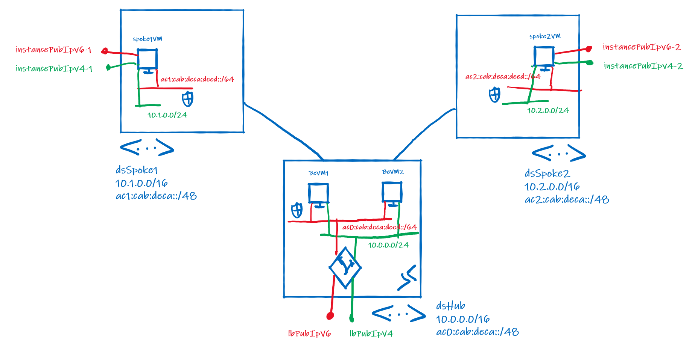

# Dual stack IPv4/IPv6 VNET topology 

This lab provides a simple environment to experiment with IPv6 in VNETs. It is written in Bicep :muscle:.

**Lab content**

- Dual stack IP4/IPv6 hub VNET.
- Dual stack IP4/IPv6 spoke VNETs peered to the hub.
- Pair of VMs in the hub, each running a web server.
- Public IPv4 and IPv6 prefixes.
- Internet-facing STANDARD Load Balancer with IPv4 and IPv6 Public IP addresses, in front of the hub VMs.
- A single VM in each of the Spokes, each with an IPv4 and an IPv6 PIP.

**Deployment**
- Log in to Azure Cloud Shell at https://shell.azure.com/ and select Bash.
- Ensure Azure CLI and extensions are up to date:
  
  `az upgrade --yes`
  
- If necessary select your target subscription:
  
  `az account set --subscription <Name or ID of subscription>`
  
- Clone the  GitHub repository:
  
  `git clone https://github.com/mblanco77/ipv6-in-vnet-bicep`
  
- Change directory:
  
  `cd ./ipv6-in-vnet-bicep`

- Create resource group:

  `az group create --name ipv6 --location eastus`

- Deploy the bicep template:

  `az deployment group create --name ipv6depl --resource-group ipv6 --template-file ipv6networkdeploy.bicep`

**Testing**
Access the Load Balancer's Public IP address over IPv4 and IPv4:
`curl lbPubIpV4:80`
`curl [lbPubIpV6]:80`  :point_left: enclose the IPv6 address in square brackets!

The response should read "BeVM1" or "BeVM2" in both cases. 
:point_right: accessing the IPv6 endpoint requires that the client has an IPv6 public address. This does not work from Cloud Shell.

Access Spoke1VM's instance level PIP over IPv4 and IPv4:
`curl instancePubIpV4-1:80`
`curl [instancePubIpv6-1]:80`  :point_left: enclose the IPv6 address in square brackets!

The response should read "spoke1VM".

Look at each VMs Effective Routes:
`az network nic show-effective-route-table -g ipv6 -n BeVM1-nic --output table`

Observe both IPv4 and IPv6 routes to peered VNETs and Internet are present.

